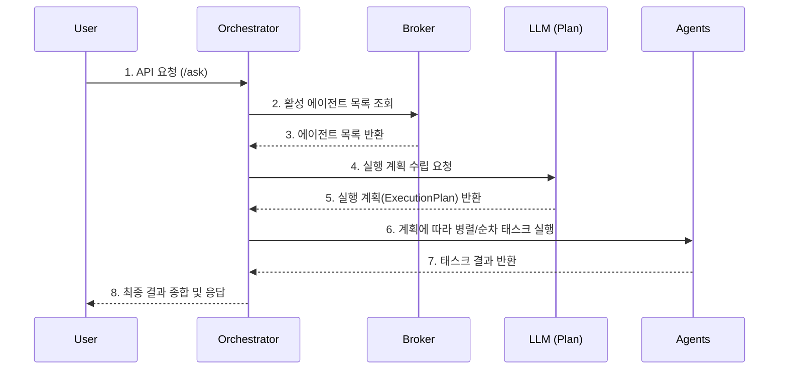

## 🤖 LLM-Based Multi-Agent Platform

  
  
  
</p\>

-----

### 📖 프로젝트 소개 (About)

이 프로젝트는 사용자의 자연어 요청을 이해하고, 여러 AI 에이전트(Agent)를 동적으로 조합하여 복잡한 문제를 해결하는 지능형 플랫폼입니다. 단순히 하나의 LLM에 의존하는 것을 넘어, 각자의 전문 분야를 가진 에이전트들이 협력하여 최적의 결과를 만들어내는 것을 목표로 합니다. 특히, 플랫폼의 핵심 코드 수정 없이 새로운 AI 기능을 가진 에이전트를 서비스에 쉽게 추가하고 확장할 수 있는 높은 서비스 확장성을 지향합니다.

-----

### ✨ 주요 특징 (Features)

  * **비동기 & 논블로킹 아키텍처**
      * `Spring WebFlux`와 `Project Reactor`를 사용하여 여러 에이전트 및 LLM API를 동시에 호출해도 I/O 병목 없이 높은 처리량을 유지합니다.
  * **유연한 모듈형 구조**
      * `broker-api`, `orchestrator-api`, `core` 등 기능별로 모듈을 명확히 분리하여 MSA로 확장 가능한 유연한 구조를 갖추고 있습니다.
  * **동적 실행 계획 수립**
      * 사용자의 요청에 맞춰 LLM이 직접 최적의 에이전트 조합과 실행 순서를 담은 계획(`ExecutionPlan`)을 동적으로 생성합니다.
  * **안정적인 시스템 운영을 위한 설계**
      * `Resilience4j`를 적용하여 특정 에이전트의 장애가 전체 시스템에 영향을 주지 않도록 `CircuitBreaker`, `Retry` 등의 패턴을 구현했습니다.
      * 주기적인 에이전트 상태 점검(`Health Check`)을 통해 사용 불가능한 에이전트는 작업에서 즉시 제외하여 신뢰도를 높였습니다.

-----

### 🏗️ 아키텍처 및 요청 흐름

-----

### 🛠️ 기술 스택 (Tech Stack)

| 구분                | 기술                                                               |
| ------------------- | ------------------------------------------------------------------ |
| **Backend** | `Spring Boot 3.4.4`, `Spring WebFlux`, `Spring Data JPA`           |
| **Language** | `Java 17+`                                                         |
| **Database** | `H2`                                                               |
| **API Documentation** | `SpringDoc` (Swagger-UI)                                           |
| **Resilience** | `Resilience4j` (Circuit Breaker, Retry, Bulkhead)                  |
| **Build Tool** | `Gradle 8.13`                                                      |

-----

### 🎯 향후 개선 과제 (TO DO)

현재 백엔드 시스템은 안정적으로 동작하지만, LLM API 응답 속도에 따른 병목 현상을 해결하는 것을 최우선 과제로 삼고 있습니다. 제시된 로드맵을 바탕으로 다음 4가지 핵심 전략을 통해 지연 없는(Latency-Free) 플랫폼으로 고도화할 계획입니다.

**1. LLM 호출 최적화 및 스트리밍 도입**
- Parallel Tool Calling: 단일 LLM 요청으로 여러 에이전트(함수)를 동시에 호출할 수 있는 Parallel Tool Calling을 도입하여, API 왕복 횟수를 최소화하고 지연 시간을 획기적으로 줄일 것입니다.
- Streaming API: LLM이 생성하는 응답을 토큰 단위로 실시간 전송하여, 사용자가 결과를 즉각적으로 확인할 수 있도록 체감 대기 시간을 대폭 개선하겠습니다.

**2. 프롬프트 엔지니어링 고도화**
- SoT (Skeleton-of-Thought): LLM이 응답의 전체 구조(개요)를 먼저 생성하고, 각 세부 항목을 병렬적으로 채워나가게 하는 SoT 프롬프팅 기법을 적용하여 지연 시간을 40~50% 단축하는 것을 목표로 합니다.
- 경량 모델 우선 사용: 단순한 계획 수립이나 분류 작업에는 gpt-4.1-mini와 같은 소형 모델(sLLM)을 우선적으로 사용하여 비용과 속도를 감축합니다.

**3. 통신 프로토콜 확장**
- AgentInvokerFactory 설계를 기반으로, 장기적으로는 **MCP(Model Context Protocol)** 와 같은 통신 프로토콜을 확장합니다. 이를 통해 더 다양한 에이전트의 등록/관리를 자동화하고, 대용량 데이터(파일, DB 테이블 등)를 효율적으로 전달하며, 더욱 높은 수준의 확장성과 재사용성을 갖춘 아키텍처를 지향합니다.
